# 🐍 Python Internals: How Python Works Under the Hood

> A comprehensive guide to understanding Python's internal architecture — from source code to execution.

---

## 📋 Table of Contents

1. [Overview](#overview)
2. [Architecture Diagram](#architecture-diagram)
3. [Execution Pipeline](#execution-pipeline)
4. [Deep Dive: Core Components](#deep-dive-core-components)
   - [Source Code](#1-source-code)
   - [Compilation to Bytecode](#2-compilation-to-bytecode)
   - [Python Virtual Machine (PVM)](#3-python-virtual-machine-pvm)
   - [Memory Management](#4-memory-management)
   - [Modules & Libraries](#5-modules--libraries)
5. [Key Limitations & Trade-offs](#key-limitations--trade-offs)
6. [Quick Reference](#quick-reference)

---

## Overview

Python works internally by **compiling your source code into bytecode**, which is then executed by the **Python Virtual Machine (PVM)**. The most common implementation, **CPython**, handles this process by:

- ✅ Checking syntax
- ✅ Generating `.pyc` files
- ✅ Interpreting bytecode line by line

---

## Architecture Diagram

```mermaid
flowchart TB
    subgraph Developer["👨‍💻 Developer Layer"]
        SC["📄 Source Code<br/>(.py files)"]
    end
    
    subgraph Compiler["⚙️ Compilation Layer"]
        LA["🔍 Lexical Analysis<br/>(Tokenization)"]
        PA["🌳 Parsing<br/>(AST Generation)"]
        BC["📦 Bytecode<br/>(.pyc files)"]
    end
    
    subgraph Runtime["🚀 Runtime Layer"]
        PVM["🖥️ Python Virtual Machine<br/>(PVM)"]
        MM["🧠 Memory Manager"]
        GC["♻️ Garbage Collector"]
    end
    
    subgraph System["💻 System Layer"]
        HEAP["📊 Private Heap"]
        OS["🖥️ Operating System"]
    end
    
    SC --> LA
    LA --> PA
    PA --> BC
    BC --> PVM
    PVM <--> MM
    MM <--> GC
    MM <--> HEAP
    PVM --> OS
    
    style Developer fill:#e1f5fe,stroke:#01579b
    style Compiler fill:#fff3e0,stroke:#e65100
    style Runtime fill:#e8f5e9,stroke:#2e7d32
    style System fill:#fce4ec,stroke:#880e4f
```

---

## Execution Pipeline

This flowchart shows the complete journey of your Python code from writing to execution:

```mermaid
flowchart LR
    subgraph Step1["Step 1"]
        A["📝 Write Code"]
    end
    
    subgraph Step2["Step 2"]
        B["🔍 Syntax Check"]
    end
    
    subgraph Step3["Step 3"]
        C["🔤 Tokenize"]
    end
    
    subgraph Step4["Step 4"]
        D["🌳 Build AST"]
    end
    
    subgraph Step5["Step 5"]
        E["📦 Generate Bytecode"]
    end
    
    subgraph Step6["Step 6"]
        F["🚀 PVM Executes"]
    end
    
    subgraph Step7["Step 7"]
        G["✅ Output"]
    end
    
    A --> B --> C --> D --> E --> F --> G
    
    style Step1 fill:#bbdefb
    style Step2 fill:#c8e6c9
    style Step3 fill:#fff9c4
    style Step4 fill:#ffe0b2
    style Step5 fill:#f8bbd9
    style Step6 fill:#d1c4e9
    style Step7 fill:#b2dfdb
```

---

## Deep Dive: Core Components

### 1. Source Code

> 📄 **Definition**: Human-readable instructions written in `.py` files using Python's syntax.

#### Characteristics

| Property | Description |
|----------|-------------|
| **Format** | Plain text (human-readable) |
| **Extension** | `.py` files |
| **Tools** | Any text editor (VS Code, PyCharm, etc.) |
| **Role** | Starting point of execution |

#### Example

```python
# This is source code
name = "Alice"
age = 25

if age >= 18:
    print(name, "is an adult")
else:
    print(name, "is a minor")
```

#### Source Code Lifecycle

```mermaid
flowchart LR
    A["📝 You Write<br/>.py file"] --> B["🔍 Syntax Check"]
    B --> C["📦 Compile to<br/>Bytecode"]
    C --> D["🚀 PVM Executes<br/>Line by Line"]
    
    style A fill:#e3f2fd
    style B fill:#fff8e1
    style C fill:#fce4ec
    style D fill:#e8f5e9
```

> [!TIP]
> Source code is the bridge between human logic and machine execution — easy to share, read, and modify.

---

### 2. Compilation to Bytecode

> ⚙️ **Definition**: Bytecode is an intermediate representation — not human-readable, not machine code — designed for the PVM.

#### Key Properties

| Property | Description |
|----------|-------------|
| **Format** | Intermediate instructions |
| **Storage** | `.pyc` files in `__pycache__/` folder |
| **Portability** | Runs on any system with Python |
| **Speed** | Faster than re-parsing source every time |

#### Compilation Process Flow

```mermaid
flowchart TD
    A["📝 Source Code Input<br/>(.py file)"] --> B["🔤 Lexical Analysis<br/>(Tokenization)"]
    B --> C["🌳 Parsing<br/>(AST Generation)"]
    C --> D["⚙️ Compilation<br/>(AST → Bytecode)"]
    D --> E["💾 Store in .pyc<br/>(__pycache__)"]
    E --> F["🚀 PVM Execution"]
    
    subgraph Tokens["Token Examples"]
        T1["KEYWORD: if"]
        T2["IDENTIFIER: name"]
        T3["OPERATOR: =="]
    end
    
    B -.-> Tokens
    
    style A fill:#e3f2fd
    style B fill:#fff8e1
    style C fill:#ffe0b2
    style D fill:#fce4ec
    style E fill:#f3e5f5
    style F fill:#e8f5e9
```

#### Bytecode Example

**Source Code:**
```python
print("Hello")
```

**Compiled Bytecode** (using `dis` module):
```
  0 LOAD_GLOBAL              0 (print)
  2 LOAD_CONST               1 ('Hello')
  4 CALL_FUNCTION            1
  6 POP_TOP
  8 LOAD_CONST               0 (None)
 10 RETURN_VALUE
```

> [!NOTE]
> Use Python's built-in `dis` module to inspect bytecode: `python -m dis your_script.py`

---

### 3. Python Virtual Machine (PVM)

> 🖥️ **Definition**: The PVM is the runtime engine that executes Python bytecode — the "heart" of Python execution.

#### PVM Architecture

```mermaid
flowchart TB
    subgraph Input["📥 Input"]
        BC["📦 Bytecode<br/>(.pyc)"]
    end
    
    subgraph PVM["🖥️ Python Virtual Machine"]
        IL["📖 Instruction<br/>Loader"]
        EX["⚡ Execution<br/>Engine"]
        EH["⚠️ Error<br/>Handler"]
    end
    
    subgraph Memory["🧠 Memory System"]
        MM["📊 Memory<br/>Manager"]
        GC["♻️ Garbage<br/>Collector"]
        HP["💾 Private<br/>Heap"]
    end
    
    subgraph Output["📤 Output"]
        RES["✅ Result"]
        ERR["❌ Exception"]
    end
    
    BC --> IL
    IL --> EX
    EX <--> MM
    MM <--> GC
    MM <--> HP
    EX --> RES
    EX --> EH
    EH --> ERR
    
    style Input fill:#e3f2fd
    style PVM fill:#fff8e1
    style Memory fill:#e8f5e9
    style Output fill:#fce4ec
```

#### How PVM Works

```mermaid
sequenceDiagram
    participant User as 👨‍💻 User
    participant Compiler as ⚙️ Compiler
    participant PVM as 🖥️ PVM
    participant Memory as 🧠 Memory
    participant OS as 💻 OS
    
    User->>Compiler: Write .py file
    Compiler->>Compiler: Syntax check
    Compiler->>Compiler: Generate bytecode
    Compiler->>PVM: Pass .pyc bytecode
    
    loop For Each Instruction
        PVM->>PVM: Read instruction
        PVM->>Memory: Allocate/access objects
        Memory->>OS: System calls (if needed)
        OS-->>Memory: Response
        Memory-->>PVM: Data
    end
    
    PVM-->>User: Output / Exception
```

#### Key Characteristics

| Feature | Description |
|---------|-------------|
| **Type** | Interpreter-based |
| **Speed** | Slower than compiled languages |
| **Portability** | Runs anywhere Python is installed |
| **Typing** | Dynamic (runtime type checking) |

> [!IMPORTANT]
> The PVM is part of CPython (the standard Python implementation). Other implementations like **PyPy** or **Jython** have different virtual machines with varying performance characteristics.

---

### 4. Memory Management

> 🧠 **Definition**: Python automatically manages memory using a private heap, memory manager, and garbage collector.

#### Memory Architecture

```mermaid
flowchart TB
    subgraph Code["📝 Your Code"]
        VAR["x = [1, 2, 3]"]
    end
    
    subgraph Manager["🔧 Memory Manager"]
        ALLOC["📦 Allocator<br/>(PyMalloc)"]
        TRACK["📊 Reference<br/>Tracker"]
    end
    
    subgraph Heap["💾 Private Heap"]
        OBJ1["Object: List"]
        OBJ2["Object: Int 1"]
        OBJ3["Object: Int 2"]
        OBJ4["Object: Int 3"]
    end
    
    subgraph GC["♻️ Garbage Collector"]
        RC["🔢 Reference<br/>Counting"]
        CYC["🔄 Cyclic<br/>Detector"]
    end
    
    VAR --> ALLOC
    ALLOC --> TRACK
    TRACK --> OBJ1
    OBJ1 --> OBJ2
    OBJ1 --> OBJ3
    OBJ1 --> OBJ4
    OBJ1 <-.-> RC
    RC <-.-> CYC
    
    style Code fill:#e3f2fd
    style Manager fill:#fff8e1
    style Heap fill:#e8f5e9
    style GC fill:#fce4ec
```

#### Reference Counting Flow

```mermaid
flowchart LR
    subgraph Step1["Create Object"]
        A["a = [1,2,3]<br/>refcount = 1"]
    end
    
    subgraph Step2["Add Reference"]
        B["b = a<br/>refcount = 2"]
    end
    
    subgraph Step3["Remove Reference"]
        C["del a<br/>refcount = 1"]
    end
    
    subgraph Step4["Object Freed"]
        D["del b<br/>refcount = 0<br/>🗑️ Deleted"]
    end
    
    Step1 --> Step2 --> Step3 --> Step4
    
    style Step1 fill:#c8e6c9
    style Step2 fill:#fff9c4
    style Step3 fill:#ffccbc
    style Step4 fill:#ef9a9a
```

#### Memory Components

| Component | Role |
|-----------|------|
| **Private Heap** | Stores all Python objects |
| **Memory Manager** | Allocates space for new objects |
| **Reference Counting** | Tracks references to each object |
| **Garbage Collector** | Frees memory when refcount = 0 |
| **PyMalloc** | Efficiently manages small memory blocks |

> [!WARNING]
> **Memory Leaks** can occur if references are kept unintentionally (e.g., in global variables or long-lived caches).

---

### 5. Modules & Libraries

> 📦 **Definition**: Modules are reusable `.py` files; Libraries are collections of modules for specific tasks.

#### Module System Architecture

```mermaid
flowchart TB
    subgraph YourCode["📝 Your Code"]
        IMPORT["import math<br/>import pandas"]
    end
    
    subgraph BuiltIn["📦 Built-in Modules"]
        MATH["math"]
        OS["os"]
        SYS["sys"]
        RANDOM["random"]
    end
    
    subgraph External["📚 External Libraries"]
        NP["NumPy"]
        PD["Pandas"]
        REQ["Requests"]
        TF["TensorFlow"]
    end
    
    subgraph PyPI["🌐 PyPI"]
        REPO["Python Package Index"]
    end
    
    IMPORT --> MATH
    IMPORT --> PD
    PyPI --> External
    
    style YourCode fill:#e3f2fd
    style BuiltIn fill:#e8f5e9
    style External fill:#fff8e1
    style PyPI fill:#fce4ec
```

#### Import Flow

```mermaid
flowchart LR
    A["📝 import statement"] --> B{"Already<br/>compiled?"}
    B -->|Yes| C["📦 Load .pyc<br/>from __pycache__"]
    B -->|No| D["⚙️ Compile to<br/>bytecode"]
    D --> E["💾 Cache .pyc"]
    C --> F["🔗 Link to<br/>program"]
    E --> F
    F --> G["✅ Ready to use"]
    
    style A fill:#e3f2fd
    style B fill:#fff8e1
    style C fill:#c8e6c9
    style D fill:#ffccbc
    style E fill:#f3e5f5
    style F fill:#b2dfdb
    style G fill:#a5d6a7
```

#### Modules vs Libraries

| Aspect | Module | Library |
|--------|--------|---------|
| **Definition** | Single `.py` file | Collection of modules |
| **Scope** | Specific functionality | Broader functionality |
| **Example** | `math`, `random` | `NumPy`, `Pandas` |
| **Installation** | Built-in or single file | Via `pip install` |

#### Popular Libraries

| Library | Purpose |
|---------|---------|
| **NumPy** | Numerical computing |
| **Pandas** | Data analysis |
| **Matplotlib** | Data visualization |
| **Requests** | HTTP requests |
| **TensorFlow / PyTorch** | Machine learning & AI |

---

## Key Limitations & Trade-offs

```mermaid
flowchart LR
    subgraph Tradeoffs["⚖️ Python Trade-offs"]
        direction TB
        SPEED["🐢 Speed<br/>Interpreted, not compiled"]
        TYPING["🔄 Dynamic Typing<br/>Runtime errors possible"]
        MEMORY["💾 Memory<br/>Higher consumption"]
    end
    
    subgraph Benefits["✅ Benefits"]
        direction TB
        PORT["🌍 Portability<br/>Runs anywhere"]
        EASY["📚 Easy to Learn<br/>Readable syntax"]
        FLEX["🔧 Flexibility<br/>Dynamic features"]
    end
    
    Tradeoffs <--> Benefits
    
    style Tradeoffs fill:#ffccbc
    style Benefits fill:#c8e6c9
```

| Limitation | Description | Mitigation |
|------------|-------------|------------|
| **Speed** | Interprets bytecode (slower than C/Java) | Use PyPy, Cython, or optimize hot paths |
| **Dynamic Typing** | Runtime type errors possible | Use type hints + mypy |
| **Memory Usage** | GC can consume more memory | Profile with `tracemalloc`, optimize data structures |

---

## Quick Reference

### Complete Execution Flow

```mermaid
flowchart TB
    A["📝 Source Code<br/>(.py)"] --> B["🔍 Lexical Analysis"]
    B --> C["🌳 AST Generation"]
    C --> D["📦 Bytecode<br/>(.pyc)"]
    D --> E["🖥️ PVM"]
    E --> F["🧠 Memory<br/>Manager"]
    F --> G["♻️ Garbage<br/>Collector"]
    E --> H["✅ Output"]
    
    style A fill:#bbdefb
    style B fill:#c8e6c9
    style C fill:#fff9c4
    style D fill:#ffe0b2
    style E fill:#f8bbd9
    style F fill:#d1c4e9
    style G fill:#b2dfdb
    style H fill:#a5d6a7
```

### Key Terms Glossary

| Term | Definition |
|------|------------|
| **CPython** | The standard Python implementation written in C |
| **Bytecode** | Intermediate code executed by the PVM |
| **PVM** | Python Virtual Machine — executes bytecode |
| **AST** | Abstract Syntax Tree — parsed representation of code |
| **GC** | Garbage Collector — automatic memory cleanup |
| **PyPI** | Python Package Index — repository of Python packages |

---

> [!TIP]
> **Want to explore bytecode?** Run this in your terminal:
> ```bash
> python -m dis your_script.py
> ```

---

*📚 Understanding Python's internals helps you write efficient code, debug errors effectively, and appreciate why Python is so portable!*